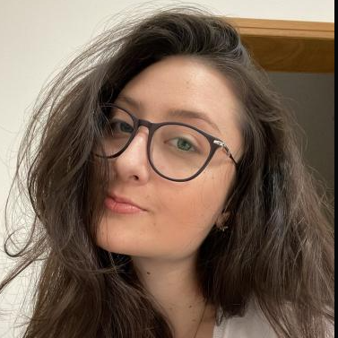

<h1 align="center"> MarAzul </h1>

# 🐟 ODS

MarAzul é um projeto que tem como objetivo contribuir com a conservação e o uso sustentável dos oceanos, mares e recursos marinhos, disponibilizando uma lista das principais organizações que apoiam essa causa e como ajudar.
Além de apresentar algumas curiosidades sobre o que existe na vida na água e dicas de preservação.

# 🛠️ Funcionalidades do projeto

# 📁 Acesso ao projeto

Acesse o projeto pelo [GitHub](https://github.com/vitoriamillnitz/Marazul) ou [GitHub Pages](https://vitoriamillnitz.github.io/Marazul/).

# ✔️ Tecnologias utilizadas

- ``HTML 5``
- ``CSS``

# Autores

Vitória Silva Millnitz
