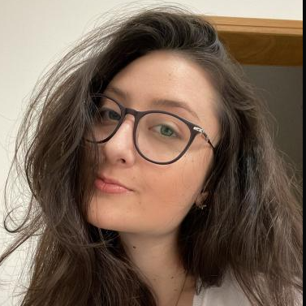

<h1 align="center"> MarAzul </h1>

# 🐟 ODS 14
MarAzul é um projeto que tem como objetivo contribuir com a conservação e o uso sustentável dos oceanos, mares e recursos marinhos, disponibilizando uma lista das principais organizações que apoiam essa causa e como ajudar. Além de apresentar algumas curiosidades sobre o que existe na vida na água e dicas de preservação.

# 🛠️ Funcionalidades do projeto

- Sobre: Contém informações importantes sobre o projeto e seu funcionamento.
- Parceiros: Lista de organizações que têm parceira com o projeto.
- Cadastro: Página que contém o formulário de cadastro e o botão de envio que direciona o usuário à página de login. 

# 📁 Acesso ao projeto

Acesse o projeto pelo [GitHub](https://github.com/vitoriamillnitz/Marazul) ou [GitHub Pages](https://vitoriamillnitz.github.io/Marazul/).

# ✔️ Tecnologias utilizadas

- ``HTML 5``
- ``CSS``

# Autores

[ Vitória Silva Millnitz]

